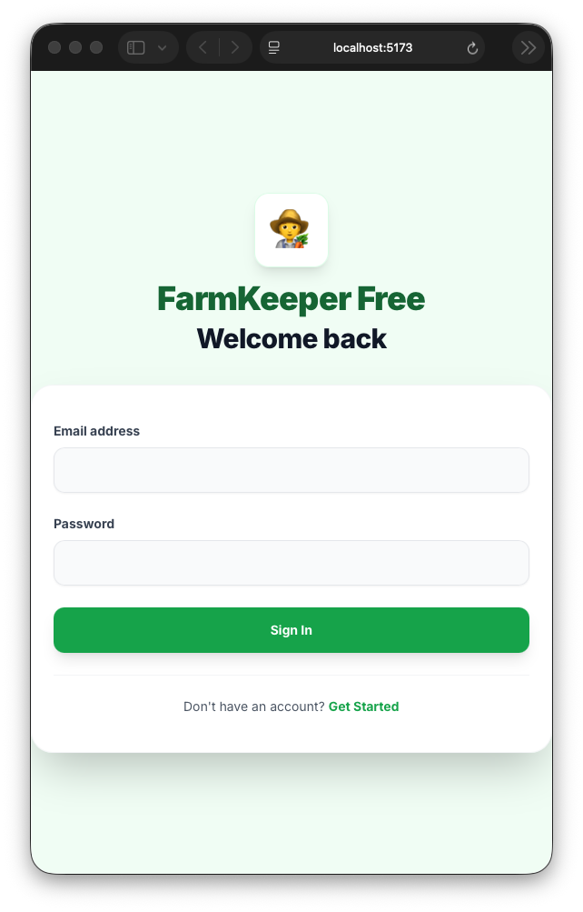

<div align="center">
  <br/>
  <h1>🧑‍🌾 FarmKeeper Free</h1>
  <p><strong>Intelligent farm management powered by Google Gemini AI</strong></p>
  <p>
    
    
    
    
    
  </p>
  <br/>
</div>

## 📸 Screenshots

| Auth Screen | Dashboard | Crop Manager |
|:---:|:---:|:---:|
|  | *(add your own)* | *(add your own)* |

> **Tip:** Run the app at `localhost:5173`, press `Cmd+Shift+4` and capture the browser window to add your own screenshots.

---

## ✨ Features

### 📊 Command Center
- **Smart Dashboard** — Real-time overview of your farm's health, crop status, and livestock alerts
- **Weather & Market Data** — Get location-based forecasts and commodity prices
- **Daily AI Insights** — Gemini-powered farming tips tailored to your region

### 🌽 Crop Manager
- **Field Tracking** — Log planting dates, varieties, acreage, and growth stages
- **Growth Monitoring** — Track days since planting and estimate harvest dates
- **Field History** — Spraying, fertilizing, scouting, and harvesting event logs

### 🐄 Livestock Manager
- **Digital Herd Book** — Detailed profiles for cattle, pigs, sheep, poultry, and more
- **Medical History** — Vaccinations, illnesses, injuries, and vet checkups
- **Health Status** — Visual tags for sick, pregnant, lactating, or quarantined

### 📸 Field Scout AI
- **Visual Diagnosis** — Snap or upload photos of crops and livestock
- **AI Analysis** — Gemini Vision identifies pests, diseases, and nutrient deficiencies
- **Actionable Advice** — Confidence scores, symptom descriptions, and treatments

### 🤖 AI Farm Advisor
- **Chat Interface** — Natural language Q&A with an expert agricultural AI
- **Search Grounding** — Google Search integration for up-to-date answers on weather, regulations, and market trends

### ☁️ Google Sheets Sync
- **Cloud Storage** — All data synced to a Google Sheet you control
- **No Lock-In** — Your data lives in a plain spreadsheet, accessible anytime
- **Free Forever** — No subscriptions, no paywalls, no limits

---

## 🚀 Quick Start

### 1. Clone & Install

```bash
git clone https://github.com/chetmcknight/FarmKeeper-Free.git
cd FarmKeeper-Free
npm install
```

### 2. Environment Setup

Create a `.env` file:

```env
VITE_API_KEY=your_gemini_api_key_here
```

Get a Gemini API key at [Google AI Studio](https://aistudio.google.com/).

### 3. Run the App

```bash
npm run dev
```

Open **http://localhost:5173** in your browser.

---

## ☁️ Google Sheets Setup

FarmKeeper Free uses Google Sheets as its cloud database. No server, no subscriptions.

### Step 1: Create the Sheet

1. Create a new Google Sheet at [sheets.new](https://sheets.new)
2. Rename the default tab to `Users`
3. Add 4 more tabs: `Crops`, `Animals`, `Farmhands`, `ScoutHistory`
4. Add header rows to each tab:

| Tab | Headers |
|:---|:---|
| **Users** | `id`, `email`, `name`, `imageUrl` |
| **Crops** | `id`, `name`, `variety`, `plantedDate`, `harvestDate`, `status`, `area`, `imageUrl`, `coverUrl`, `history_json` |
| **Animals** | `id`, `name`, `type`, `breed`, `birthDate`, `deathDate`, `status`, `weight`, `gender`, `imageUrl`, `coverUrl`, `medicalHistory_json` |
| **Farmhands** | `id`, `name`, `role`, `phone`, `email`, `status`, `notes`, `startDate`, `imageUrl`, `coverUrl` |
| **ScoutHistory** | `id`, `date`, `imageBase64`, `result_json` |

### Step 2: Share Publicly

Click **Share** → set to **"Anyone with the link can edit"**.

### Step 3: Enable the Sheets API

1. Go to [Google Cloud Console](https://console.cloud.google.com/apis/dashboard)
2. Select your project (or create one)
3. Enable the **Google Sheets API**
4. Go to **Credentials** → **Create Credentials** → **API Key**
5. (Recommended) Restrict the key to HTTP referrers and the Sheets API only

### Step 4: Deploy the Apps Script

1. In your sheet, go to **Extensions → Apps Script**
2. Replace the default code with the contents of [`apps-script/Code.gs`](apps-script/Code.gs)
3. Click **Deploy → New Deployment**
   - **Type:** Web app
   - **Execute as:** Me
   - **Access:** Anyone
4. Copy the deployment URL (ends in `/exec`)

### Step 5: Configure the App

1. Open FarmKeeper Free at **http://localhost:5173**
2. Go to **Settings → Data & Storage**
3. Enter:
   - **Spreadsheet ID** — from your sheet URL (the long string between `/d/` and `/edit`)
   - **API Key** — from Google Cloud Console
   - **Apps Script URL** — the deployment URL from Step 4
4. Click **Save & Reload with Sheets**

Your data now syncs to Google Sheets automatically!

---

## 🧑‍🌾 Local Storage (Default)

Out of the box, FarmKeeper Free uses **localStorage** in your browser. No setup required — just run the app and go. Data persists in your browser until you clear it.

Switch to Google Sheets whenever you want by following the setup above.

---

## 🛠️ Tech Stack

| Layer | Technology |
|:---|:---|
| **Framework** | React 18 + TypeScript |
| **Build Tool** | Vite 5 |
| **Styling** | Tailwind CSS 3 |
| **AI** | Google Gemini API (`@google/genai`) |
| **Cloud Sync** | Google Sheets REST API + Apps Script |
| **Auth** | Built-in (email/password, localStorage-backed) |

---

## 📦 Production Build

```bash
npm run build
```

Output goes to `dist/`. Deploy with any static host (Vercel, Netlify, Cloud Run, etc.).

---

## 🐳 Docker

```bash
docker build -t farmkeeper-free .
docker run -p 8080:80 farmkeeper-free
```

---

## 📁 Project Structure

```
FarmKeeper-Free/
├── apps-script/
│   └── Code.gs              # Google Apps Script (write proxy)
├── components/
│   ├── AIGuide.tsx           # AI chat advisor
│   ├── AnimalManager.tsx     # Livestock management
│   ├── AuthScreen.tsx        # Login / Register
│   ├── ChatWidget.tsx        # Floating AI chat
│   ├── CropManager.tsx       # Crop / field tracking
│   ├── Dashboard.tsx         # Main dashboard
│   ├── FarmhandManager.tsx   # Team management
│   ├── FieldScout.tsx        # AI visual diagnosis
│   ├── Navigation.tsx        # Sidebar navigation
│   └── Settings.tsx          # App settings + Sheets config
├── context/
│   └── AuthContext.tsx       # Auth provider
├── services/
│   ├── geminiService.ts      # Gemini AI integration
│   ├── googleSheetsService.ts # Sheets API + Apps Script client
│   └── mockBackend.ts        # Backend selector (local vs sheets)
├── types.ts                  # Shared TypeScript types
├── App.tsx                   # Root component
├── index.tsx                 # Entry point
└── index.html                # HTML shell
```

---

## 📄 License

MIT — free to use, modify, and distribute.

---

<div align="center">
  <p>Built with ❤️ for farmers everywhere</p>
  <p>
    <a href="https://github.com/chetmcknight/FarmKeeper-Free">GitHub</a>
  </p>
</div>
